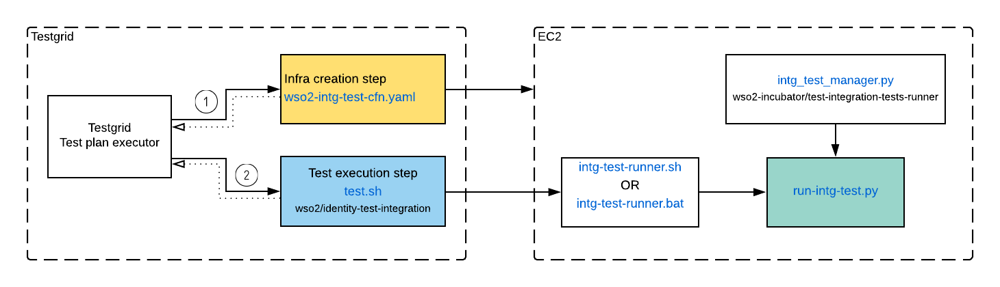

Product(IAM) integration test automation scripts are maintained here.

These test scripts support executing existing product integration tests at wso2/product-is repo
in both Linux and Windows environments. Most of the logic is written in python as it is
an interoperable, scriptable language.

The script execution order, and how testgrid invokes them is illustrated in the below diagram:

The files mentioned above are contained in three git repos:

1. Infra creation is done via AWS cloudformation scripts.
It is located at
[wso2-intg-test-cfn.yaml](https://github.com/wso2/testgrid/blob/33ecb6d76b6397963273574338ffa8aa5d223c93/jobs/intg-test-resources/wso2-intg-test-cfn.yaml) in wso2/testgrid repo.

2. Test execution entrypoint of testgrid is the **test.sh** which is located
in this repo.

3. Test execution scripts that are common to all Carbon products (APIM/EI/IS)
are located in a common repo wso2-incubator/test-integration-tests-runner
 https://github.com/wso2-incubator/test-integration-tests-runner

 Find a sample testgrid job configuration where all these are executed in
 order, in here:
 [intg-test-wso2is-master-testgrid.yaml](https://github.com/wso2/testgrid-job-configs/blob/7369823b79df8bb6626a80cb872b0a7ee3c9a550/RELEASES/intg-test-wso2is-master-testgrid.yaml)
